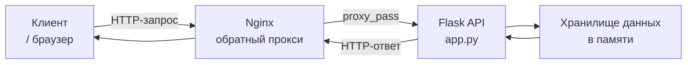

# Лабораторная работа 2. Проектирование и реализация клиент-серверной системы. HTTP, веб-серверы и RESTful веб-сервисы

## Вариант 19

---

## Задание

Выполнить следующие задачи:

1. Анализ главной страницы от kommersant.ru.
2. Реализовать REST API "Проекты компании".
3. Настроить Nginx как обратный прокси для Flask API.

---


## Архитектура решения

В работе реализована классическая **клиент-серверная архитектура** с использованием **Nginx** в качестве обратного прокси.


## Компоненты системы

**Клиент (curl / браузер)**  
Отправляет HTTP-запросы к Nginx для получения данных или отправки информации.

**Nginx**  
Выступает в роли обратного прокси. Принимает входящие запросы от клиента и перенаправляет их к Flask-приложению в соответствии с настроенным правилом `location /api/`.

**Flask API (app.py)**  
Обрабатывает HTTP-запросы, полученные от Nginx. Реализует бизнес-логику работы с каталогом проектов (CRUD операции).

**Хранилище данных**  
Имитация базы данных. Данные о проектах (список `projects`) хранятся в оперативной памяти приложения Flask.

---

## Описание реализации

### Анализ HTTP-ответов kommersant.ru

Для анализа HTTP-запросов использовалась утилита `telnet`.

```bash
telnet http://kommersant.ru/ 80
```

**Что было проанализировано в выводе:**

| Элемент вывода | Значение |
|----------------|----------|
| `> GET / HTTP/1.1` | Запрос, который telenet отправил серверу |
| `< HTTP/1.1 301 Moved Permanently` | Сервер ответил статусом 301 Moved Permanently |
| `< server: QRATOR` | Сервер kommersant.ru использует веб-сервер Nginx |
| `< location: https://kommersant.ru/` | Адрес, на который нужно перенаправить запрос |
| `< content-type: text/html` | Тип содержимого ответа — HTML |
| `* Connected to kommersant.ru (185.73.193.68)` | IP-адрес сервера kommersant.ru |


**Итоги анализа:**

- Статус-код: **301 Moved Permanently** (постоянное перенаправление)
- Сервер: **QRATOR**
- Тип содержимого: **text/html**
- Перенаправление на: `https://kommersant.ru/`
- Используемый протокол: **HTTP/1.1**

---

### Реализация REST API «Проекты компании»

API реализован с использованием **Flask**.  
Код приложения находится в файле **app.py**

**Структура объекта Project:**
```json
{
  "id": 1,
  "project_name": "Farm",
  "manager": "Qiqi"
}
```

**Реализованные методы:**

- `GET /api/projects` — получить список всех проектов
- `GET /api/projects/<id>` — получить проект по идентификатору
- `POST /api/projects` — добавить новый проект

**Код приложения (app.py):**
```python
from flask import Flask, jsonify, request

app = Flask(__name__)

# База данных проектов (в памяти)
projects = [
    {"id": 1, "project_name": "Farm", "manager": "Qiqi"},
    {"id": 2, "project_name": "Airport", "manager": "Joe"}
]
next_id = 3

@app.route('/api/projects', methods=['GET'])
def get_projects():
    return jsonify({'projects': projects})

@app.route('/api/projects/<int:project_id>', methods=['GET'])
def get_project(project_id):
    project = next((p for p in projects if p["id"] == project_id), None)
    if project is None:
        return jsonify({'error': 'Проект не найден'}), 404
    return jsonify(project)

@app.route('/api/projects', methods=['POST'])
def create_project():
    global next_id
    data = request.json
    
    if not data or 'project_name' not in data:
        return jsonify({'error': 'Project name must be'}), 400
    
    new_project = {
        'id': next_id,
        'project_name': data['project_name'],
        'manager': data.get('manager', 'No employee')
    }
    projects.append(new_project)
    next_id += 1
    return jsonify(new_project), 201

if __name__ == '__main__':
    app.run(host='0.0.0.0', port=5000)
```

Запуск сервера выполняется командой:
```bash
python3 app.py
```


Сервер запускается на `http://127.0.0.1:5000`

**Проверка API:**

Получение списка всех проектов:
```bash
curl http://127.0.0.1:5000/api/projects
```


Добавление нового проекта:
```bash
curl -X POST -H "Content-Type: application/json" \
-d '{"project_name": "AI development", "manager": "Rosalina"}' \
http://127.0.0.1:5000/api/projects
```


### Настройка Nginx как обратного прокси

**Установка Nginx**

Установка веб-сервера выполнена командой:

```bash
sudo apt install nginx -y
```


**Настройка конфигурации**

Конфигурационный файл `/etc/nginx/sites-available/default` был дополнен следующим блоком:

```nginx
location /api/ {
    proxy_pass http://127.0.0.1:5000;
    proxy_set_header Host $host;
    proxy_set_header X-Real-IP $remote_addr;
}
```

Данная конфигурация указывает Nginx перехватывать все запросы, начинающиеся с `/api/`, и перенаправлять их на Flask-приложение, работающее на порту 5000. Директивы `proxy_set_header` передают Flask оригинальный заголовок Host и реальный IP-адрес клиента.

Проверка конфигурации:
```bash
sudo nginx -t
```

Перезапуск Nginx:
```bash
sudo systemctl restart nginx
```

Проверка работы через Nginx:
Запрос через Nginx (порт 80):
```bash
curl http://localhost/api/projects
```


## Используемые технологии

- Python 3
- Flask
- Nginx
- HTTP / REST
- curl

---

## Запуск проекта

Для запуска проекта необходимо:

1. Активировать виртуальное окружение:
```bash
source venv/bin/activate
```

2. Запустить Flask-сервер:
```bash
python3 app.py
```

3. Запустить Nginx (если не запущен):
```bash
sudo systemctl start nginx
```

## Вывод

В ходе выполнения лабораторной работы были изучены принципы работы HTTP-протокола: на примере ответов kommersant.ru разобран статус 301 Moved Permanently, заголовки server и content-type, а также освоена работа с утилитой curl.

Практически закреплены навыки создания REST API на Flask с реализацией методов GET и POST для работы с каталогом проектов.

Освоена настройка Nginx в качестве обратного прокси: добавление конфигурации location /api/, проверка синтаксиса и перезапуск сервера.

Полученные навыки позволяют разрабатывать и разворачивать клиент-серверные приложения с использованием современных веб-технологий.

