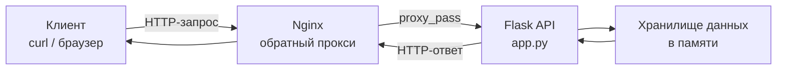

# Лабораторная работа 2. Проектирование и реализация клиент-серверной системы. HTTP, веб-серверы и RESTful веб-сервисы

## Вариант 19

---

## Задание

Выполнить следующие задачи:

1. Анализ HTTP-ответов от kommersant.ru при поиске товара.
2. Реализовать REST API "Проекты компании".
3. Настроить Nginx как обратный прокси для Flask API.

---


## Архитектура решения

В работе реализована классическая **клиент-серверная архитектура** с использованием **Nginx** в качестве обратного прокси.


## Компоненты системы

**Клиент (curl / браузер)**  
Отправляет HTTP-запросы к Nginx для получения данных или отправки информации.

**Nginx**  
Выступает в роли обратного прокси. Принимает входящие запросы от клиента и перенаправляет их к Flask-приложению в соответствии с настроенным правилом `location /api/`.

**Flask API (app.py)**  
Обрабатывает HTTP-запросы, полученные от Nginx. Реализует бизнес-логику работы с каталогом проектов (CRUD операции).

**Хранилище данных**  
Имитация базы данных. Данные о проектах (список `projects`) хранятся в оперативной памяти приложения Flask.

---

## Описание реализации

### Анализ HTTP-ответов kommersant.ru

Для анализа HTTP-запросов использовалась утилита `curl` с ключом `-v` (verbose).

```bash
curl -v http://kommersant.ru/
```

