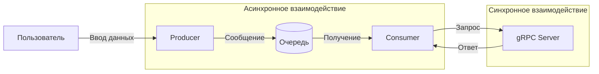

# Лабораторная работа 3.1. Организация асинхронного взаимодействия микросервисов с помощью брокера сообщений

## Вариант 19

## Задачи:

1. **A/B тестирование.**  
   Producer отправляет ID пользователя.  
   gRPC сервис определяет, к какой группе (A или B) относится пользователь, и возвращает название группы.

2. **Вычисление факториала.**  
   Producer отправляет число.  
   gRPC сервис вычисляет его факториал и возвращает результат.

3. **Поиск самой частой буквы.**  
   Producer отправляет текст.  
   gRPC сервис находит в нём самую часто встречающуюся букву и возвращает её.

## Архитектура системы

    C -->|Вывод результата| U
