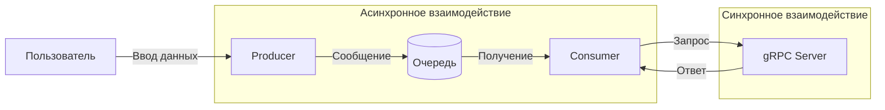

# Лабораторная работа 3.1. Организация асинхронного взаимодействия микросервисов с помощью брокера сообщений

## Вариант 19

## Задачи:

1. **A/B тестирование.**  
   Producer отправляет ID пользователя.  
   gRPC сервис определяет, к какой группе (A или B) относится пользователь, и возвращает название группы.

2. **Вычисление факториала.**  
   Producer отправляет число.  
   gRPC сервис вычисляет его факториал и возвращает результат.

3. **Поиск самой частой буквы.**  
   Producer отправляет текст.  
   gRPC сервис находит в нём самую часто встречающуюся букву и возвращает её.

## Архитектура системы

## Общая логика работы

- Пользователь вводит сообщение в Producer.
- Producer отправляет сообщение в очередь RabbitMQ.
- Consumer получает сообщение из очереди.
- Consumer определяет тип задачи по префиксу: `subscribe:`, `pass:` или `freq:`.
- Consumer вызывает соответствующий метод gRPC сервера.
- gRPC сервер обрабатывает запрос.
- Результат возвращается и выводится пользователю.

## Используемые технологии

- **Python** — язык реализации всех компонентов.
- **gRPC** — фреймворк для синхронного взаимодействия.
- **Protocol Buffers (protobuf)** — язык описания контракта.
- **RabbitMQ** — брокер сообщений для асинхронного взаимодействия.
- **Docker** — платформа для контейнеризации RabbitMQ.
- **Pika** — Python-клиент для RabbitMQ.

# ЧАСТЬ 1. Реализация gRPC (синхронное взаимодействие)

Создан файл `message_service.proto`, в котором описан сервис `ABTestingService` с тремя методами:

- `AssignAB` — A/B тестирование (принимает `user_id`, возвращает группу `A` или `B`).
- `Factorial` — вычисление факториала (принимает `number`, возвращает `result`).
- `MostFrequentLetter` — поиск самой частой буквы (принимает `text`, возвращает `most_frequent_letter`).

Сгенерированы Python-файлы `message_service_pb2.py` и `message_service_pb2_grpc.py` с использованием `grpc_tools`.

Сервер запущен и протестирован через клиента:

    C -->|Вывод результата| U
