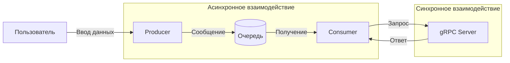

# Лабораторная работа 3.1. Организация асинхронного взаимодействия микросервисов с помощью брокера сообщений

## Вариант 19

## Задачи:

1. **A/B тестирование.**  
   Producer отправляет ID пользователя.  
   gRPC сервис определяет, к какой группе (A или B) относится пользователь, и возвращает название группы.

2. **Вычисление факториала.**  
   Producer отправляет число.  
   gRPC сервис вычисляет его факториал и возвращает результат.

3. **Поиск самой частой буквы.**  
   Producer отправляет текст.  
   gRPC сервис находит в нём самую часто встречающуюся букву и возвращает её.

## Архитектура системы


## Общая логика работы

- Пользователь вводит сообщение в Producer.
- Producer отправляет сообщение в очередь RabbitMQ.
- Consumer получает сообщение из очереди.
- Consumer определяет тип задачи по префиксу: `subscribe:`, `pass:` или `freq:`.
- Consumer вызывает соответствующий метод gRPC сервера.
- gRPC сервер обрабатывает запрос.
- Результат возвращается и выводится пользователю.

## Используемые технологии

- **Python** — язык реализации всех компонентов.
- **gRPC** — фреймворк для синхронного взаимодействия.
- **Protocol Buffers (protobuf)** — язык описания контракта.
- **RabbitMQ** — брокер сообщений для асинхронного взаимодействия.
- **Docker** — платформа для контейнеризации RabbitMQ.
- **Pika** — Python-клиент для RabbitMQ.

# ЧАСТЬ 1. Реализация gRPC (синхронное взаимодействие)

Создан файл `message_service.proto`, в котором описан сервис `ABTestingService` с тремя методами:

- `AssignAB` — A/B тестирование (принимает `user_id`, возвращает группу `A` или `B`).
- `Factorial` — вычисление факториала (принимает `number`, возвращает `result`).
- `MostFrequentLetter` — поиск самой частой буквы (принимает `text`, возвращает `most_frequent_letter`).

Сгенерированы Python-файлы `message_service_pb2.py` и `message_service_pb2_grpc.py` с использованием `grpc_tools`.

## Реализованы методы

### 1. A/B тестирование (AssignAB)

Метод принимает ID пользователя. Если ID чётный, пользователь попадает в группу A, если нечётный — в группу B. Это детерминированный подход, который не требует хранения состояния: один и тот же пользователь всегда будет направлен в одну и ту же группу.

### 2. Вычисление факториала (Factorial)

Метод принимает целое неотрицательное число и возвращает его факториал. Вычисление выполняется с помощью встроенной математической функции. Для отрицательных чисел возвращается ошибка, так как факториал для них не определён.

### 3. Поиск самой частой буквы (MostFrequentLetter)

Метод принимает текст на русском или английском языке. Все буквы приводятся к нижнему регистру для учёта регистра. Подсчитывается частота каждой буквы (цифры, пробелы и знаки препинания игнорируются). Возвращается буква с максимальной частотой. Если в тексте несколько букв встречаются одинаковое количество раз, возвращается первая из них.

## gRPC сервер

Реализован класс-сервис, наследующий от сгенерированного класса `ABTestingServiceServicer`, в котором переопределены все три метода. Сервер запускается на порту `50051` с использованием пула потоков для обработки одновременных запросов.

Основные функции сервера:
- Ожидание входящих gRPC-запросов на указанном порту;
- При получении запроса определение типа метода (AssignAB, Factorial или MostFrequentLetter);
- Выполнение соответствующей бизнес-логики;
- Формирование и отправка ответа клиенту;
- Логирование всех входящих запросов и результатов в консоль.

Сервер предназначен для синхронного взаимодействия: клиент отправляет запрос и блокируется до получения ответа. Это подходит для сценариев, где требуется немедленный результат.

## gRPC клиент для тестирования

Реализован тестовый клиент, который подключается к серверу по адресу `localhost:50051`, последовательно вызывает все три метода и выводит полученные результаты. Клиент используется для отладки и проверки работоспособности сервера до добавления брокера сообщений.

Функции тестового клиента:
- Установка соединения с gRPC сервером;
- Создание заглушки (stub) для вызова удалённых процедур;
- Формирование запросов с тестовыми данными;
- Отправка запросов и получение ответов;
- Вывод результатов в консоль для визуальной проверки.

## Результат тестирования gRPC сервера

При запуске клиента были получены следующие результаты:

- **A/B тестирование**: для `user_id = 42` (чётный) получена группа `A`;
- **Факториал**: для `number = 5` получен результат `120`;
- **Поиск самой частой буквы**: для текста `"мама мыла раму"` получена буква `"м"`.

Сервер успешно обрабатывает запросы и возвращает корректные ответы. Логи сервера подтверждают выполнение каждого запроса с указанием входных параметров и вычисленных результатов.

# ЧАСТЬ 2. Реализация RabbitMQ (асинхронное взаимодействие)

## Запуск брокера сообщений через Docker

Создан файл `docker-compose.yml`, который описывает сервис `rabbitmq` с использованием образа `rabbitmq:3.9-management`. Контейнер пробрасывает порты:
- `5672` — для подключения клиентов (producer и consumer);
- `15672` — для веб-интерфейса управления.

Заданы учётные данные: логин `user`, пароль `password`. Данные брокера сохраняются в Docker-томе для обеспечения персистентности очередей и сообщений.

**Команда запуска:**
```bash
docker compose up -d
```

Сервер запущен и протестирован через клиента:


