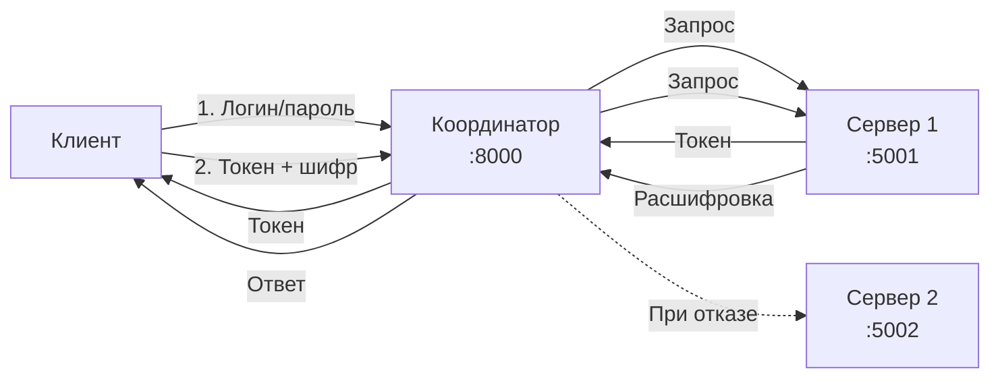

# Лабораторная работа №04. Реализация механизмов безопасности и отказоустойчивости в распределенной системе

**Студент:** Чумаков Олег

**Группа:** ЦИБ-241

**Вариант:** 19 (Предварительная авторизация — выдача токенов доступа)

## 1. Цели и задачи работы

### Цель работы
Разработать и исследовать распределенную систему, обеспечивающую защищенную передачу данных с использованием взаимной аутентификации (mTLS), симметричного шифрования (Fernet) и механизма предварительной авторизации с выдачей токенов.

### Индивидуальное задание (Вариант 19)

**Предварительная авторизация.** Сервер выдает токены доступа. Клиент сначала получает токен, потом использует его для авторизованных запросов. Реализовать:
- Эндпоинт `/login` для проверки учетных данных (логин/пароль) и выдачи уникального токена.
- Эндпоинт `/api/data`, который принимает токен и зашифрованное сообщение, проверяет валидность токена и только после этого расшифровывает и обрабатывает данные.
- Автоматическую маршрутизацию запросов через координатор с сохранением логики отказоустойчивости.

## 2. Архитектура системы

### Схема архитектуры

