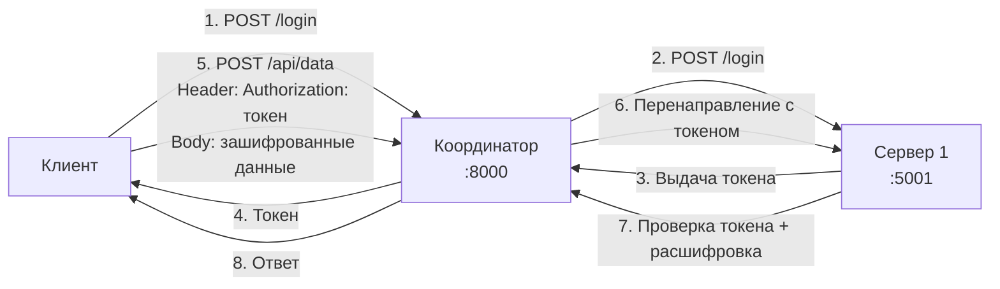
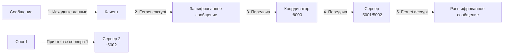

# Лабораторная работа №04. Реализация механизмов безопасности и отказоустойчивости в распределенной системе

**Студент:** Чумаков Олег  
**Группа:** ЦИБ-241  
**Вариант:** 19 (Предварительная авторизация — выдача токенов доступа)

---

## 📌 Оглавление

1. [Цель работы](#цель-работы)
2. [Инструменты и технологический стек](#инструменты-и-технологический-стек)
3. [Архитектура системы](#архитектура-системы)
   - 3.1. Компоненты системы
   - 3.2. Схема потоков данных
   - 3.3. Протоколы и шифрование
4. [Реализация системы](#реализация-системы)
   - 4.1. Настройка PKI (генерация сертификатов)
   - 4.2. Генерация ключа Fernet
   - 4.3. Сервер обработки данных (server.py)
   - 4.4. Координатор (coordinator.py)
   - 4.5. Клиент (client.py)
5. [Индивидуальное задание (Вариант 19)](#индивидуальное-задание-вариант-19)
6. [Демонстрация работы](#демонстрация-работы)
   - 6.1. Успешная аутентификация и передача данных
   - 6.2. Отказоустойчивость (Failover)
7. [Анализ системы](#анализ-системы)
8. [Заключение](#заключение)

---

## Цель работы

Разработать распределенную систему, обеспечивающую:

- защищенную передачу данных с использованием **взаимной аутентификации (mTLS)** и **симметричного шифрования (Fernet)**;
- **отказоустойчивость** через автоматическое переключение (failover) между серверами;
- **предварительную авторизацию** — выдачу и проверку токенов доступа (Вариант 19).

---

## Инструменты и технологический стек

| Компонент | Технология | Назначение |
|-----------|------------|------------|
| **ОС** | Ubuntu 20.04 LTS (WSL) | Среда выполнения |
| **Язык** | Python 3.8+ | Разработка всех компонентов |
| **Веб-фреймворк** | Flask | Создание серверов и координатора |
| **HTTP-клиент** | requests | Выполнение HTTP/HTTPS запросов |
| **Шифрование** | cryptography (Fernet) | Симметричное шифрование данных |
| **Генерация токенов** | secrets | Криптостойкая генерация токенов |
| **Безопасность** | OpenSSL | Генерация ключей и сертификатов X.509 |
| **mTLS** | SSLContext | Взаимная аутентификация сервера и клиента |

---

## Архитектура системы

### 3.1. Компоненты системы

| Компонент | Порт | Роль |
|-----------|------|------|
| **Клиент** | динамический | Инициирует запросы, шифрует данные, управляет токеном |
| **Координатор** | 8000 | Балансировщик нагрузки, проверяет доступность серверов, переключает при отказе |
| **Сервер 1** | 5001 | Основной сервер обработки данных |
| **Сервер 2** | 5002 | Резервный сервер (для отказоустойчивости) |

### 3.2. Схема потоков данных

#### Схема 1: Базовая передача сообщений


#### Схема 2: Шифрование Fernet



## 3.3. Протоколы и шифрование

| Сегмент | Протокол | Шифрование |
|---------|----------|------------|
| Клиент → Координатор | HTTP | Fernet |
| Координатор → Сервер | HTTPS + mTLS | TLS + Fernet |

Координатор не расшифровывает данные — сквозное шифрование.

---

## 4. Реализация системы

### 4.1. Настройка PKI

```bash
openssl req -x509 -newkey rsa:4096 -keyout ca_key.pem -out ca_cert.pem -days 365
openssl req -newkey rsa:4096 -keyout server_key.pem -out server.csr
openssl x509 -req -in server.csr -CA ca_cert.pem -CAkey ca_key.pem -out server_cert.pem -days 365
openssl req -newkey rsa:4096 -keyout client_key.pem -out client.csr
openssl x509 -req -in client.csr -CA ca_cert.pem -CAkey ca_key.pem -out client_cert.pem -days 365
```

### 4.2. Генерация ключа Fernet

Скрипт `generate_key.py` используется для генерации симметричного ключа шифрования Fernet.

```
from cryptography.fernet import Fernet

key = Fernet.generate_key()
with open("encryption_key.txt", "wb") as f:
    f.write(key)
    
print(f"Ключ Fernet сгенерирован и сохранён в encryption_key.txt")
print(f"Длина ключа: {len(key)} байт")
```

### Результат выполнения скрипта:

```
Ключ Fernet сгенерирован и сохранён в encryption_key.txt
Длина ключа: 44 байт
```

### Содержимое файла `encryption_key.txt` (пример):

```
gAAAAABmQxTjZqW5Rq8QxHk3YKJpPaMKl5vF5qZ5vF5qZ5vF5qZ5vF5qZ5vF5qZ5vF5qZ5vF5qZ5vA==
```

### 4.3. Сервер обработки данных (server.py)

**Запуск сервера на порту 5001:**

```bash
python3 server.py 5001
```

**Результат запуска сервера:**

```
✓ Ключ Fernet загружен: 44 байт
Запуск сервера на порту 5001
   Хранилище токенов: 0 записей
✓ Сертификаты сервера загружены
✓ mTLS настроен: проверка клиентских сертификатов обязательна
 * Serving Flask app 'server'
 * Running on all addresses (0.0.0.0)
 * Running on https://127.0.0.1:5001
```

**При получении запроса на `/login`:**
```
✓ Новый токен выдан: 9ca8047daface716dc817efac928eb49
  Всего активных токенов: 1
127.0.0.1 - - [07/Jun/2026 12:34:56] "POST /login HTTP/1.1" 200 -
```

**При получении запроса на `/api/data` с валидным токеном:**
```
✓ Токен валиден: 9ca8047daface716dc817efac928eb49
✓ Данные расшифрованы: Привет, мир!
127.0.0.1 - - [07/Jun/2026 12:35:10] "POST /api/data HTTP/1.1" 200 -
```

**При получении запроса на `/api/data` с невалидным токеном:**
```
❌ Отказ доступа: невалидный токен 11111111111111111111111111111111
127.0.0.1 - - [07/Jun/2026 12:35:20] "POST /api/data HTTP/1.1" 401 -
```

---

### 4.4. Координатор (coordinator.py)

**Запуск координатора:**

```bash
python3 coordinator.py
```

**Результат запуска координатора:**

```
📋 Список серверов: ['https://127.0.0.1:5001', 'https://127.0.0.1:5002']
🚀 Запуск координатора на порту 8000
   Режим: балансировка нагрузки + failover
 * Serving Flask app 'coordinator'
 * Running on all addresses (0.0.0.0)
 * Running on http://127.0.0.1:8000
```

**Лог координатора при успешном запросе (Сервер 1 доступен):**

```
📨 Запрос: POST /api/data
   Заголовки: {'Host': '127.0.0.1:8000', 'Content-Type': 'application/json'}...
   → Попытка 1: https://127.0.0.1:5001
   ✓ Сервер https://127.0.0.1:5001 ответил с кодом 200
127.0.0.1 - - [07/Jun/2026 12:35:10] "POST /api/data HTTP/1.1" 200 -
```

**Лог координатора при отказе Сервера 1 (автоматическое переключение на Сервер 2):**

```
📨 Запрос: POST /api/data
   Заголовки: {'Host': '127.0.0.1:8000', 'Authorization': '9ca8047d...'}...
   → Попытка 1: https://127.0.0.1:5001
   ❌ Сервер https://127.0.0.1:5001 недоступен: Connection refused
   → Попытка 2: https://127.0.0.1:5002
   ✓ Сервер https://127.0.0.1:5002 ответил с кодом 200
127.0.0.1 - - [07/Jun/2026 12:36:00] "POST /api/data HTTP/1.1" 200 -
```

**Лог координатора при недоступности всех серверов:**

```
📨 Запрос: POST /api/data
   → Попытка 1: https://127.0.0.1:5001
   ❌ Сервер https://127.0.0.1:5001 недоступен: Connection refused
   → Попытка 2: https://127.0.0.1:5002
   ❌ Сервер https://127.0.0.1:5002 недоступен: Connection refused
   ❌ Все серверы недоступны!
127.0.0.1 - - [07/Jun/2026 12:36:30] "POST /api/data HTTP/1.1" 503 -
```

---

### 4.5. Клиент (client.py)

**Результат выполнения клиента (успешный сценарий):**

```bash
python3 client.py
```

```
🔧 Инициализация клиента...
✓ Ключ Fernet загружен: 44 байт

🔐 Получение токена...
✅ Токен получен: 9ca8047daface716dc817efac928eb49

📝 Ввод данных
   Сообщение: Привет, мир!
🔒 Данные зашифрованы
   Зашифрованная строка: gAAAAABmQxTjZqW5Rq8QxHk3YKJpPaMKl5vF5qZ5vF5qZ5...

📤 Отправка данных на сервер...
✅ Успешно!
   Статус: ok
   Сообщение: Processed: Привет, мир!
```

**Результат выполнения клиента (координатор не запущен):**

```bash
python3 client.py
```

```
🔧 Инициализация клиента...
✓ Ключ Fernet загружен: 44 байт

🔐 Получение токена...
❌ Ошибка: координатор не запущен (порт 8000)
```

**Результат выполнения клиента (невалидный токен на сервере):**

```bash
python3 client.py
```

```
🔧 Инициализация клиента...
✓ Ключ Fernet загружен: 44 байт

🔐 Получение токена...
✅ Токен получен: 9ca8047daface716dc817efac928eb49

📝 Ввод данных
   Сообщение: test
🔒 Данные зашифрованы

📤 Отправка данных на сервер...
❌ Ошибка авторизации: невалидный токен
```

**Результат выполнения клиента (Сервер 1 остановлен, failover на Сервер 2):**

```bash
python3 client.py
```

```
🔧 Инициализация клиента...
✓ Ключ Fernet загружен: 44 байт

🔐 Получение токена...
✅ Токен получен: 9ca8047daface716dc817efac928eb49

📝 Ввод данных
   Сообщение: Проверка failover
🔒 Данные зашифрованы

📤 Отправка данных на сервер...
✅ Успешно!
   Статус: ok
   Сообщение: Processed: Проверка failover
```
(координатор автоматически переключил запрос с порта 5001 на 5002)
