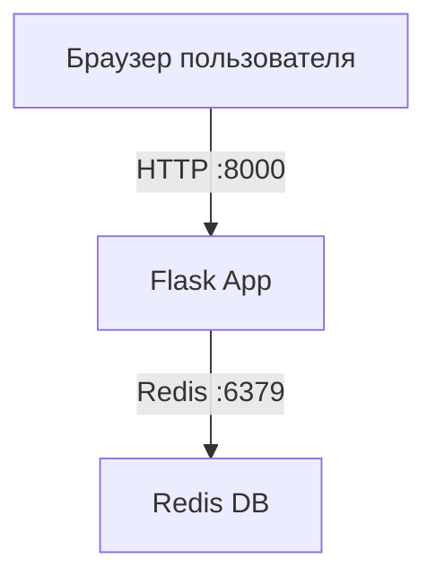

# Лабораторная работа №05  
# Проектирование и реализация комплексной микросервисной системы с использованием Docker Compose

## Студент

- **ФИО:** Чумаков Олег
- **Группа:** ЦИБ-241
- **Вариант:** 19

# Цель работы

Научиться:

- запускать многоконтейнерные приложения;
- организовывать взаимодействие между сервисами;
- использовать Docker Compose для оркестрации;
- изменять бизнес-логику и инфраструктуру проекта;
- работать с Redis как с внешним сервисом хранения данных.

# Индивидуальное задание (Вариант 19)

Для варианта 19 необходимо:

1.  **Бизнес-логика (`app.py`):** Выводить число посещений, возведённое в квадрат (`count * count`), с темой "Прибыль в рублях".
2.  **Инфраструктура (`docker-compose.yml`):** Добавить для веб-сервиса `dns: 8.8.8.8`.
3.  **Среда сборки (`Dockerfile`):** Добавить метку `LABEL description="My Lab"` и указать `maintainer="Чумаков Олег"`.

# Бизнес-кейс

## «Счетчик посетителей стенда»

Необходимо создать веб-приложение:

- Flask отображает страницу;
- Redis хранит количество посещений;
- счетчик не сбрасывается при перезапуске web-сервиса.

# Архитектура проекта



# Ход выполнения работы

## 1. Создание проекта

Была создана рабочая директория проекта:

```bash
mkdir lab_05
cd lab_05
```

## 2. Создание файла requirements.txt

Был создан файл `requirements.txt` со списком необходимых зависимостей:

```text
Flask==2.0.1
Werkzeug==2.3.7
redis==4.6.0
```

Используемые библиотеки:

- Flask — создание веб-приложения;
- Werkzeug — библиотека для работы Flask;
- redis — подключение к Redis.

## 3. Создание файла app.py

Был создан файл `app.py`, содержащий код Flask-приложения.

Приложение выполняет следующие функции:

- принимает HTTP-запросы;
- подключается к Redis;
- увеличивает счетчик посещений;
- отображает количество посещений пользователю.

Также в рамках **варианта 19** было добавлено возведение числа в квадрат:

```python
@app.route('/')
def hello():
    current_count = get_hit_count()
    squared_count = current_count * current_count   # <-- Изменение для варианта 19
    
    return f'''
    <h1 style="color: green;">Бизнес-стенд "Инновации"</h1>
    <p>
        Текущее число посетителей: <strong>{current_count}</strong><br>
        Результат (число²): <strong>{squared_count}</strong>
    </p>
'''
```

## 4. Создание Dockerfile

Был создан файл `Dockerfile` для сборки Docker-образа Flask-приложения.

Содержимое файла:

```dockerfile
FROM python:3.9-alpine

LABEL description="My Lab"
LABEL maintainer="Чумаков Олег"

WORKDIR /code

COPY requirements.txt requirements.txt

RUN pip install -r requirements.txt

COPY . .

CMD ["python", "app.py"]
```

В рамках варианта 19 были добавлены метки:

```dockerfile
LABEL description="My Lab"
LABEL maintainer="Чумаков Олег"
```

## 5. Создание docker-compose.yml

Был создан файл `docker-compose.yml`.

Docker Compose используется для запуска нескольких контейнеров одной командой.

Содержимое файла:

```yaml
services:
  web:
    build: .
    container_name: web_app_variant_19
    ports:
      - "8000:5000"
    dns:
      - 8.8.8.8
    depends_on:
      - redis
    restart: on-failure

  redis:
    image: redis:alpine
    container_name: redis_db_variant_19
    restart: on-failure
```

В рамках варианта 19 была добавлена настройка DNS:
```
yaml
dns:
  - 8.8.8.8
```

## 6. Сборка и запуск проекта
Для сборки и запуска контейнеров использовалась команда:
```
bash
docker compose up -d --build
```

После запуска Docker Compose:
-создает сеть проекта;
-запускает контейнер Redis;
-собирает Docker-образ Flask-приложения;
-запускает контейнер web.

Принцип работы приложения
После открытия страницы:

```text
http://localhost:8000
```
происходит следующий процесс:

1. браузер отправляет HTTP-запрос Flask-приложению;
2. Flask получает запрос;
3. Flask обращается к Redis;
4. Redis увеличивает значение ключа hits;
5. Flask получает новое значение счетчика;
6. происходит вычисление квадрата числа;
7. пользователю отображается обновленное количество посещений и его квадрат.

Проверка работы проекта
Проверка контейнеров
Использовалась команда:
```bash
docker compose ps
```
В результате оба контейнера имеют статус Up (работают).
    

Проверка работы веб-приложения
В браузере был открыт адрес:

```text
http://localhost:8000
```


Проверка меток Dockerfile
Для проверки изменений в Dockerfile использовалась команда:

```bash
grep "LABEL" Dockerfile
```


## Использованные технологии
Docker;
Docker Compose;
Python;
Flask;
Redis.

## Вывод
В ходе лабораторной работы было разработано многоконтейнерное веб-приложение с использованием Docker Compose.
Были получены навыки:
-создания Docker-образов;
-pапуска многоконтейнерных приложений;
-настройки Docker Compose;
-организации взаимодействия контейнеров;
-использования Redis как внешнего хранилища данных;
-реализации индивидуальных изменений бизнес-логики, инфраструктуры и среды сборки.

## В рамках варианта 19 были успешно реализованы:

Бизнес-логика: вывод квадрата числа посещений (count * count);
Инфраструктура: добавлен DNS 8.8.8.8 для веб-сервиса;
Среда сборки: добавлены метки LABEL description="My Lab" и LABEL maintainer="Чумаков Олег"
